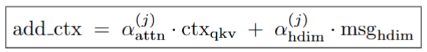
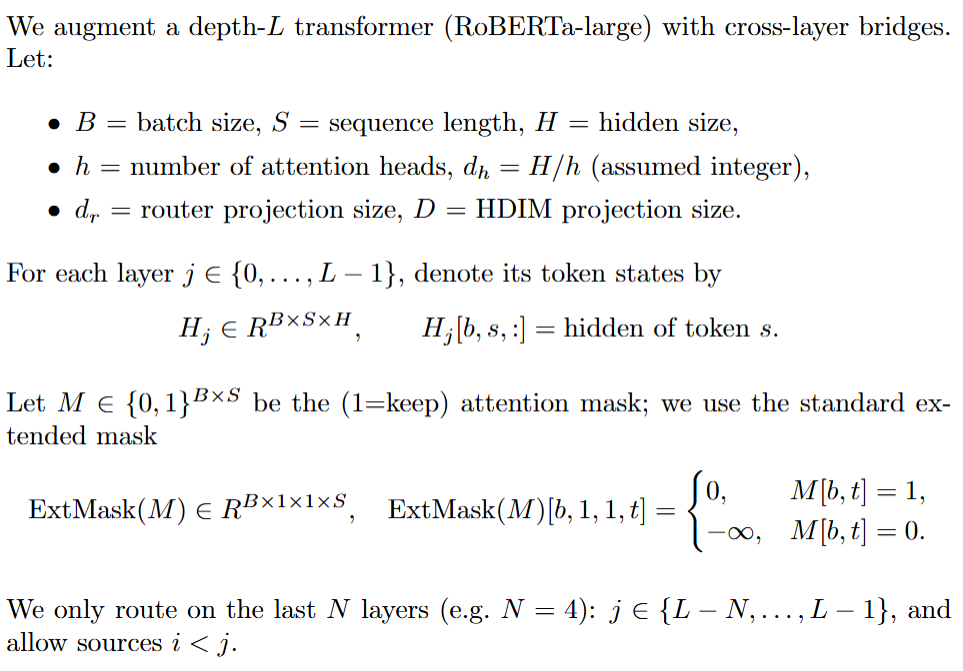
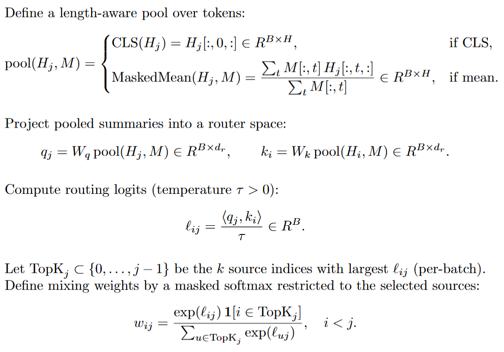
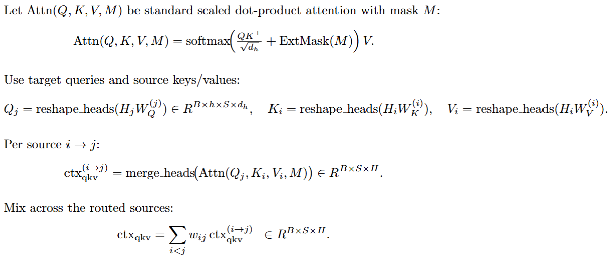
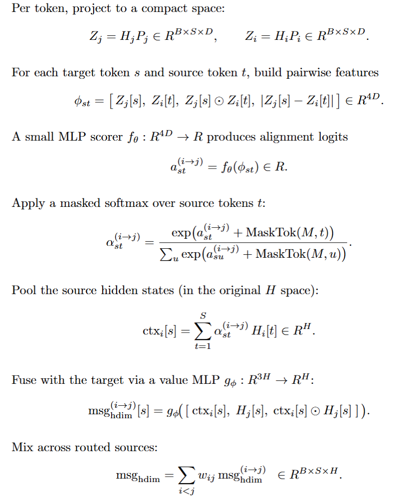

# Cross-Layer Routing Bridges (XLRB) for Transformers

This repo implements and evaluates **cross-layer communication mechanisms** on top of `roberta-large` for the GLUE RTE task. It provides a full-stack research platform with modular training, run orchestration, and GPU profiling built in. 

We test two families of *bridges* — **QKV** (classical cross-attention across layers) and **HDIM** (higher-dimensional token–pair messages) — along with **hybrids** that combine both. 

## System Architecture
- Backend: FastAPI (REST API) + Celery worker, with Redis as broker/backend.
- Training Core: PyTorch 2.x + Transformers (roberta-large), gradient checkpointing, clean config surface for ablations and overrides.
- Database: SQLite for run metadata, epochs, and artifacts (paths + sizes).
- Frontend: React + Vite + Tailwind dashboard for submitting runs, observing live progress, browsing artifacts, and inspecting profiling.
- Profiling: Nsight Systems (timeline/CSV/SQLite) + Nsight Compute (kernels). Includes WSL-friendly kernel sanity tests and on-demand training-window profiling.

> **Baseline:** plain `roberta-large` on RTE dev ≈ **86.6%**.  
> **This repo:** HDIM-only H9 reaches **87.36%** (↑), hybrids A8 (**86.28%**) and A3 (**85.92%**) are competitive.

All runs are **deterministic**, with seeds fixed and PyTorch set to reproducible mode. Results are reported on RTE dev with no cherry-picking: every ablation, successful or collapsed, is logged.

## Contents

- [Model Overview](#model-overview)
- [Mathematical Formulation](#mathematical-formulation)
  - [1. Routing (select source layers)](#1-routing-select-source-layers)
  - [2. QKV cross-layer message](#2-qkv-cross-layer-message)
  - [3. HDIM (higher-dimensional) message](#3-hdim-higher-dimensional-message)
  - [4. Blending, normalization, and injection (pre-ffn)](#4-blending-normalization-and-injection-pre-ffn)
  - [5. Expressivity note](#5-expressivity-note)
- [Training Setup (defaults used in sweeps)](#training-setup-defaults-used-in-sweeps)
- [Reading Usage](#reading-usage)
- [Knobs To Tune](#knobs-to-tune)
- [Results — All 50 Ablations (RTE, RoBERTa-large with Cross-Layer Bridges)](#results--all-50-ablations-rte-roberta-large-with-cross-layer-bridges)
  - [Headline: Top 10 Runs](#headline-top-10-runs)
  - [1.1–1.10 (HDIM-only)](#11–110-hdim-only)
  - [1.11–1.20 (HDIM-only advanced)](#111–120-hdim-only-advanced)
  - [1.21–1.30 (HDIM-only: masks/router/gates)](#121–130-hdim-only-masksroutergates)
  - [2.1–2.10 (Hybrid QKV + HDIM, early-stop rules)](#21–210-hybrid-qkv--hdim-early-stop-rules)
  - [2.11–2.20 (Hybrid, with live usage metrics)](#211–220-hybrid-with-live-usage-metrics)
- [Reproducibility](#reproducibility)

## Model Overview
On late target layers, a learned **router** selects earlier source layers. Each routed layer receives two possible messages:

- **QKV bridge:** target queries attend to source keys/values (like normal attention, but *across layers*).
- **HDIM bridge:** a small MLP kernel computes nonlinear token–pair messages from source to target.

Per-layer gates blend them:

This `add_ctx` is injected into the residual stream of the target layer, pre-FFN.

| Approach | What it does | Strengths | Caveats |
|---|---|---|---|
| **QKV bridge** | Target Q attends to source K/V across layers | Simple, strong baseline; reuses attention geometry | Fixed **bilinear** similarity |
| **HDIM bridge** | Nonlinear token-pair kernel via tiny MLPs | **More expressive** similarity/value fusion | Slightly higher compute; tune dims & gates |
| **Hybrid (QKV+HDIM)** | Compute both; blend with learned per-layer gates | Lets model **pick per layer**; robust | If one path is useless, gates suppress it (watch usage) |

# Mathematical Formulation

---

## 1. Routing (select source layers)

---

## 2. QKV cross-layer message

---

## 3. HDIM (higher-dimensional) message

---

## 4. Blending, normalization, and injection (pre-FFN)

---

## 5. Expressivity note

The QKV scorer is **bilinear** in $(q,k)$: $s_{ij} = q^\top k$.  
HDIM exposes elementwise products and absolute differences and passes them through an MLP $(f_\theta, g_\phi)$, i.e., a **learned nonlinear kernel** over $(Z_j,Z_i,H_j,H_i)$.  
Thus HDIM can subsume dot-product behaviors (by collapsing to a linear map) and represent nonlinear similarity rules that dot product cannot.

---

**Defaults used in our sweeps:** $k{=}1$, $N{=}4$, $d_r{=}128$, $D{=}24$; routing pool = mean (hybrids sometimes prefer CLS); $\tau{=}0.7$; gates initialized to small positive values.

---

## Training Setup (defaults used in sweeps)
- Backbone: `roberta-large`, MAX_LEN=128
- Optim: AdamW (encoder **1.5e-5**, head **3e-4**), weight decay 0.01
- Scheduler: linear with **10% warmup**
- Label smoothing: **0.05**
- Batch size: **8**
- Epochs: HDIM-only **3**; Hybrid **5** (early-stop if epoch-1 < 0.70)
- AMP + grad clip (1.0); reproducible seeds

---

## Reading Usage
Instrumented scripts log per-layer usage:
- **Gates**: `alpha_attn`, `alpha_hdim`  
- **Contribution norms**: `qkv_norm_mean`, `hdim_norm_mean`  
- **Routing histograms**: which sources were picked  
Interpretation: if norms/gates skew, that path dominates; if both non-trivial, hybridization is active.

---

## Knobs To Tune
- `topk` (1–2 was best here)  
- `route_last_n` (e.g. 4)  
- `route_dim` (128 baseline, 256 tested)  
- `route_pool` = `mean` or `cls`  
- `route_temp` (too sharp collapsed on RTE)  
- **HDIM fusion**: `concat_only` consistently strongest  
- **HDIM scorer**: 4-term MLP > bilinear  
- Gate inits (small but >0 so paths can grow)

---

# Results — All 50 Ablations (RTE, RoBERTa-large with Cross-Layer Bridges)

---

## Headline: Top 10 Runs

| Rank | ID | Brief | Best Acc |
| --- | --- | --- | ---: |
| 1 | **H9** | HDIM-only, 4-term, **val=concat_only**, mean routing | **0.8736** |
| 2 | **A8** | Hybrid (QKV+HDIM), **router CLS** | **0.8628** |
| 3 | **A3** | Hybrid, **QKV-only** | 0.8592 |
| 4 | H3 | HDIM-only, stronger start (gate=0.10) | 0.8484 |
| 5 | H27 | HDIM-only, **alpha softplus** | 0.8412 |
| 6 | H13 | HDIM-only, cosine + concat_only | 0.8412 |
| 7 | H8 | HDIM-only, pair=bilinear | 0.8375 |
| 8 | H10 | HDIM-only, share Zj/Zi projections | 0.8303 |
| 9 | H23 | HDIM-only, cross-only + concat_diff_hadam | 0.8303 |
|10 | H18 | HDIM-only, value residual | 0.8267 |

**Takeaway:** Router design and value fusion dominate. QKV-only is strong; HDIM-only wins when fusion is lean (`concat_only`) and gates are sane.

---

## 1.1–1.10 (HDIM-only)

| ID | Config highlight | Best Acc |
| --- | --- | ---: |
| H9_val_concat_only | **val=concat_only** | **0.8736** |
| H3_gate0p10 | init_gate_hdim=0.10 | 0.8484 |
| H8_pair_bilinear | pair=bilinear | 0.8375 |
| H10_share_proj | share projections p_i=p_j | 0.8303 |
| H1_proj32_mlp128 | proj=32, mlp=128 | 0.8159 |
| H6_last6 | route_last_n=6 | 0.7834 |
| H7_router_temp0p5 | route_temp=0.5 | 0.7040 |
| H2/H4/H5 | (small/proj/drop0/CLS pool) | 0.5271 |

---

## 1.11–1.20 (HDIM-only advanced)

| ID | Config highlight | Best Acc |
| --- | --- | ---: |
| H13_cosine_concat_only | cosine + **concat_only** | **0.8412** |
| H18_val_residual | residual on value path | 0.8267 |
| H14_gate0p10_drop0p05 | stronger gate + 0.05 drop | 0.8267 |
| H16_entreg_1e3 | ent-regularized alignments | 0.7545 |
| H15_last3 | route_last_n=3 | 0.7112 |
| H11/H12/H17/H19/H20 | others | 0.5271–0.8051 |

---

## 1.21–1.30 (HDIM-only: masks/router/gates)

| ID | Config highlight | Best Acc |
| --- | --- | ---: |
| H27_alpha_softplus | **positive (softplus) gate** | **0.8412** |
| H23_cross_only_concat_diff_hadam | cross-only + richer fusion | 0.8303 |
| H21_cross_only | cross sentence pairs only | 0.7690 |
| H28_val_gelu | GELU in value MLP | 0.7437 |
| H22/H24/H25/H26/H29/H30 | others | 0.5271–0.5704 |

---

## 2.1–2.10 (Hybrid QKV + HDIM, early-stop rules)

| ID | Config highlight | Best Acc | Notes |
| --- | --- | ---: | --- |
| **A8_Router_CLS** | **router CLS** | **0.8628** | best hybrid |
| **A3_QKV_only** | **QKV-only** | **0.8592** | strong baseline |
| A1/A2/A4/A5/A6/A7/A9/A10 | various | early-stop / <0.70 ep1 | see note |

---

## 2.11–2.20 (Hybrid, with live usage metrics)

| ID | Config highlight | Best Acc |
| --- | --- | ---: |
| Original | baseline hybrid (topk=1, lastN=4, mean) | **0.8592** |
| topk=2 | two sources | 0.8412 |
| topk=3 | three sources | 0.8375 |
| route_dim=256 | larger router key/query | 0.8303 |
| route_last_n=2 | fewer targets | – |
| route_last_n=6 | more targets | – |
| route_temp=0.5 | sharper router | – |
| route_pool=cls | CLS pooling | – |
| ablate_attn_bridge | disable QKV bridge (α_attn=0) | – |
| ablate_hdim_bridge | disable HDIM bridge (α_hdim=0) | – |

**Note:** A dash (–) = early-stop triggered after epoch 1 (<0.70), no meaningful best.

---

- **Worked:** lean HDIM fusion (`concat_only`), QKV-only, CLS router.  
- **Collapsed:** overly sharp routing (temp=0.5), over-constrained masks, HDIM sharing. 

---

## Reproducibility

Each script prints:
- per-epoch train loss/EMA/acc  
- validation accuracy/F1  
- (hybrid metrics script) **live bridge usage**: QKV/HDIM norms, gate values, source histograms.

